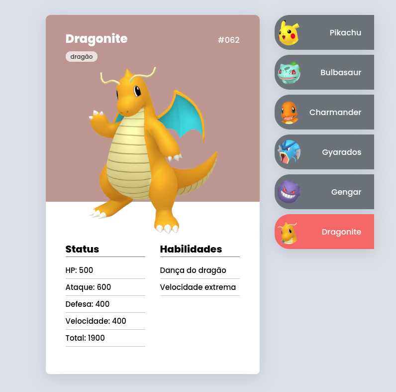

# Pokédex - Uma Biblioteca de Pokémon!

Este é um projeto do Dev em Dobro, que segui passo a passo em uma das aulas do curso DevQuest. 

### Imagem exemplo do site

### Links

- **Live Site URL:** [GithubPages](https://rodolfo-brand.github.io/pokedex/)
- **Repositório:** [GitHub](https://github.com/rodolfo-brand/pokedex)

---

## Meu Processo

### Feito com

 
  
  
  

### O que Aprendi

Neste projeto, reforcei e pratiquei os seguintes conceitos:

Durante a criação desta Pokédex, aprendi e pratiquei como:

* **Organizar as informações:** Como colocar todo o texto e imagens no lugar certo usando o HTML.

* **Deixar tudo estilizado:** Como usar o CSS para dar cores, tamanhos e alinhar os elementos, fazendo com que a Pokédex tenha uma boa aparência.
* **Fazer as coisas se moverem:** Como usar o JavaScript para que, ao clicar no nome de um Pokémon na lista, o cartão dele apareça e os outros se escondam.
* **Adaptar para celulares:** Como fazer com que a Pokédex se ajuste e funcione bem em telas de celulares e tablets, além de computadores.
* **Trabalhar em partes:** Eu dividi o projeto em pequenos pedaços, adicionando uma parte de cada vez, o que foi ótimo para eu poder trabalhar com multiplas versões do código caso eu cometesse um erro. Também é bastante útil para eu manter o foco!

### Próximos Passos

Quero continuar melhorando minhas habilidades em:

* **Código mais organizado:** Encontrar jeitos de deixar o código ainda mais fácil de entender e de mexer no futuro.

* **Deixar acessível para todos:** Fazer com que a Pokédex possa ser usada por pessoas com diferentes necessidades, como quem usa leitores de tela.
* **Testar para não errar:** Aprender a criar testes automáticos para ter certeza de que tudo funciona como esperado.
* **Criar designs ainda melhores:** Entender mais sobre como criar telas que sejam bonitas e fáceis de usar.
---
### Recursos Úteis
[Curso Dev Quest](https://www.instagram.com/devemdobro?utm_source=ig_web_button_share_sheet&igsh=ZDNlZDc0MzIxNw==):
Esse curso é sensacional, está me ajudando muito como iniciante na área de programação. Recomendo que voces busquem os irmãos para aprender programação do zero.

## Autor
### Rodolfo Brand

  
  
  
  <a href="htt